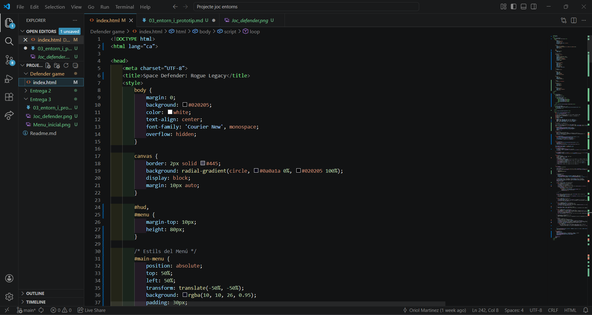
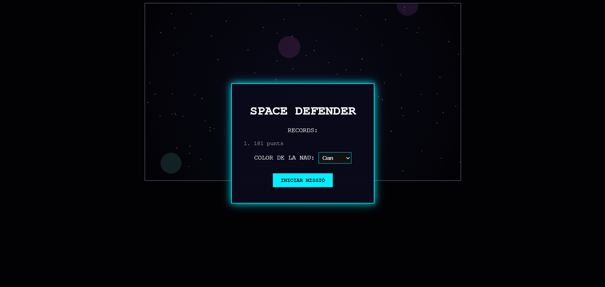
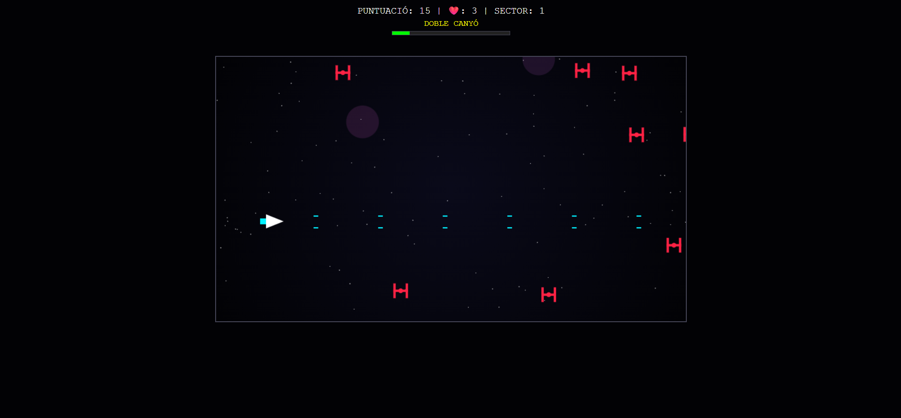

# Documentació de Desenvolupament:

## 1. IDE utilitzat i configuració bàsica
Per al desenvolupament d'aquest microvideojoc s'ha utilitzat l'entorn **Visual Studio Code (VS Code)**.

*   **Configuració:** S'ha utilitzat l'obertura directa del fitxer al navegador (file:// protocol) per a les proves, ja que el projecte és autònom i no requereix un servidor web local.
*   **Llenguatges:** El projecte es basa exclusivament en estàndards web: HTML per a l'estructura, CSS per a l'estil bàsic i JavaScript per a tota la lògica del joc.
*   **Depuració:** S'han utilitzat les *Chrome DevTools* (Consola i pestanya de Rendiment) per assegurar que el bucle de joc es mantingui a 60 FPS estables.

## 2. Decisions inicials d’implementació
S'han pres les següents decisions tècniques per garantir la viabilitat del prototip:

*   **Renderitzat en Canvas:** S'utilitza el mètode `getContext('2d')` de l'API Canvas per dibuixar directament sobre el llenç, evitant la sobrecàrrega que suposaria gestionar centenars de nodes DOM per a cada bala o enemic.
*   **Arquitectura d'Entitats:** Totes les entitats (nau, enemics, bales, asteroides) es gestionen mitjançant llistes dinàmiques (arrays) que es recorren i s'actualitzen en cada iteració del bucle.
*   **Gestió de Teclat:** S'utilitza un objecte global `keys` per emmagatzemar l'estat de les tecles (`true`/`false`), cosa que permet moviments diagonals fluids i disparar mentre es mou la nau.

## 3. Evidències visuals

*   **Captura de l'IDE:**

*   **Captura del Prototip:**

## 4. Codi i Prototip Executable
El fitxer principal és **`index.html`**, el qual és autònom i executable en qualsevol navegador modern[cite: 1]. Les funcions clau del prototip són:
*   `reset()`: Inicialitza les variables i l'estat global[cite: 1].
*   `loop()`: El motor que coordina el moviment, la detecció de col·lisions i el dibuixat de cada frame[cite: 1].
*   `fire()`: Lògica que determina quin tipus de projectil es genera segons el *power-up* actiu[cite: 1].

## 5. Control de versions (Commits)
S'han seguit les bones pràctiques de Git amb els següents commits:

1.  **`feat: inicialitzar motor de renderitzat canvas i moviment de la nau`**: Establiment de l'estructura bàsica i controls d'usuari[cite: 1].
2.  **`feat: implementar sistema d'enemics i lògica de col·lisions`**: Creació del sistema de dany i onades d'enemics bàsiques[cite: 1].
3.  **`feat: afegir sistema de power-ups i combat contra caps de sector`**: Implementació dels tipus de munició (S, D, R, P) i la mecànica del Boss[cite: 1].
4.  **`fix: optimitzar cadència enemiga i neteja de memòria d'entitats`**: Ajustos de dificultat "Aggressive" i eliminació d'objectes fora de pantalla[cite: 1].

## 6. Condicions mínimes assolides
*   **Sense errors crítics:** El joc s'executa correctament i gestiona el reinici automàticament després de la derrota[cite: 1].
*   **Interacció funcional:** El jugador pot moure's i disparar simultàniament amb una resposta immediata[cite: 1].
*   **Bucle de joc:** El cicle de vida `requestAnimationFrame` garanteix una experiència fluida i coherent[cite: 1].